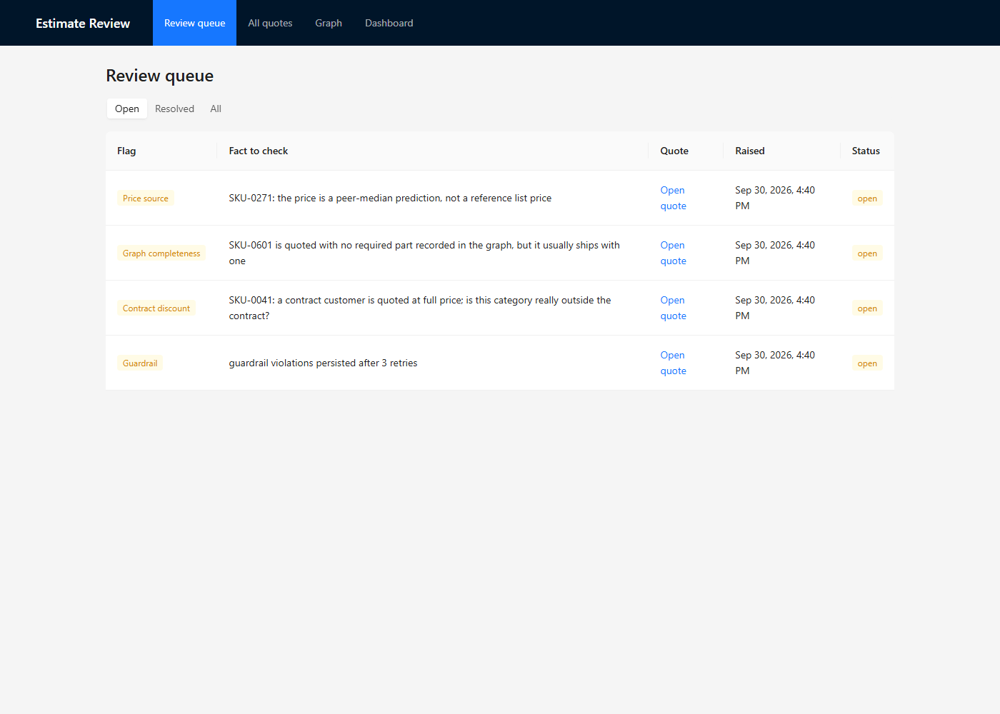
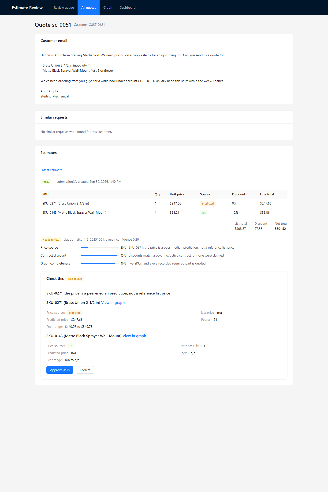
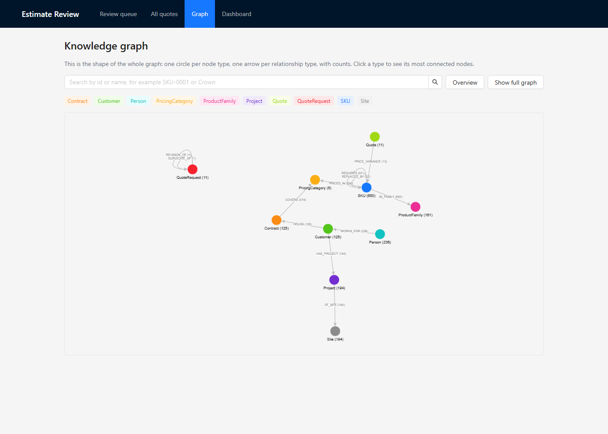
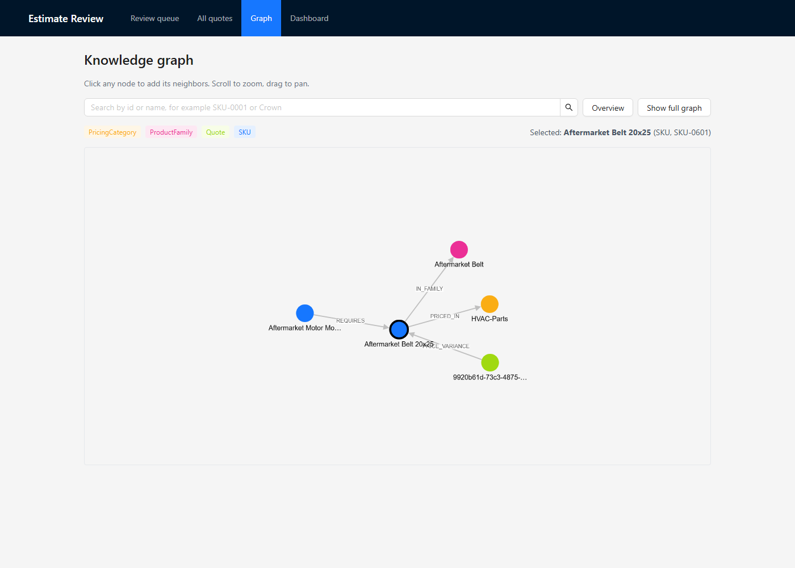
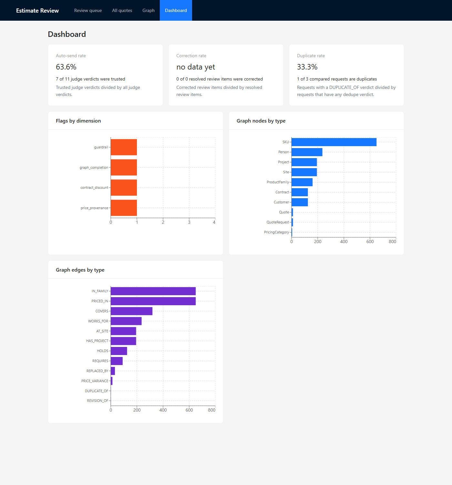

# 05. Demo Path (5 minutes)

A click path through the running app, with what I say at each step. All entities below come from the synthetic seeded data. The screenshots in `images/` were taken from the running app on 2026-09-30 with headless Chrome, against the state this file describes (4 open flags, nothing resolved yet).

## Before I start

- Start the stack with `docs/new-machine-setup.md`: databases, schema, reference data, LLM snapshot, `seed_demo.py --yes`, the API on port 8000, a graph rebuild, and the UI on port 5173.
- Check: `curl localhost:8000/v1/graph/stats` shows 650 SKU nodes, and the review queue shows 4 open flags.
- Say this once at the start: "Everything you will see is synthetic. The model calls in the seed are scripted stand-ins, so the judge scores are fixed numbers. What is real is everything downstream: intake resolution, dedupe, guardrails, graph checks, evidence, review, and consolidation."

## Step 1. Review queue (60 seconds)

Open `http://localhost:5173/`.

What I see: four open flags, one per kind: Price source, Graph completeness, Contract discount, Guardrail.

What I say:
- "This is the reviewer's screen. Each row is one fact to check, not a whole quote."
- "Three of these came from the judge: price source, graph completeness, and contract discount. The fourth, Guardrail, is a draft the code guardrails blocked after three retries. It never reached the judge, so it cost nothing to score."
- "Each flag names one dimension and one sentence. That is the design: a reviewer checks one thing."

## Step 2. Quote detail with evidence (90 seconds)

Click "Open quote" on the first row (Price source). This is quote `sc-0051`, customer `CUST-0121`, Sterling Mechanical.

What I see: the customer email, the estimate lines, the totals, the judge's three scores, and a "Check this" card with the evidence.

What I say:
- "Top: the original email. Messy, no part numbers. Below: the estimate. Line one, SKU-0271, Brass Union 2-1/2 in, is marked `predicted`. Line two has a list price and a 12 percent contract discount."
- "The judge scored three dimensions. Price source got 20 percent, and the other two got 95 and 90. The overall confidence is the lowest one, 0.20, so this goes to a human."
- "The evidence card shows what the judge saw: predicted price 247.66, from 171 peers, in a band of 140.07 to 349.73. The reviewer can approve it as is, or correct the price."
- "Two honest notes. The 0.20 is a scripted score in this demo. With the real judge and its prompt anchors, 171 peers would probably not score that low, because the anchor only forces a low score under 10 peers. And the quantities are 1 even though the email says 4 and 2, because the scripted extraction sets every quantity to 1."
- "This SKU has no list price because the seed removes it on purpose, to plant a pricing gap. The dataset's own unpriced SKUs appear in none of the scenarios."

Optional detail: click "View in graph" next to a SKU to jump to the graph page for that node.

## Step 3. The graph explorer (90 seconds)

Click "Graph" in the top bar.

What I say:
- "This is the shape of the whole graph. One circle per node type, one arrow per relationship type, with counts. 650 SKUs, 125 customers, 125 contracts, 194 sites, and so on."
- "The arrows I care about are REPLACED_BY, 32 of them, which is how a discontinued part points at its replacement. REQUIRES, 91, which is which part needs which accessory. And COVERS, 319, which is which contract covers which pricing category."
- "Three relationship types in the schema never occur in this data: FOR_PROJECT, VARIANT_OF, and SUPERSEDES. I would rather tell you than have you spot it."

Now open `http://localhost:5173/graph?node=SKU-0601` (or search "SKU-0601" and click the result).

What I say:
- "This is SKU-0601, an aftermarket belt. It sits in the Aftermarket Belt family, it is priced in the HVAC-Parts category, and another part, an aftermarket motor mount, requires it."
- "This is the case behind the second flag in the queue: the belt was quoted with no required part recorded. The graph is how the system answers 'what does this part need', in one hop, with a visible path."
- "I would not draw the whole graph live. It is 1712 nodes. I built it in levels: schema first, then a type's 60 most connected nodes, then one hop at a time."

## Step 4. Dashboard (45 seconds)

Click "Dashboard".

What I say:
- "Three rates, all computed from Postgres. Auto-send rate, 63.6 percent, which is 7 of 11 judge verdicts trusted. Duplicate rate, 33.3 percent, 1 of 3 compared requests. And correction rate, which says 'no data yet' rather than 0 percent, because nothing has been resolved."
- "That 'no data yet' is deliberate. A rate is null, not zero, when nothing has been measured, so the dashboard cannot show a real-looking 0."
- "Below: flags by dimension, and graph counts by node and edge type."

## Step 5. The loop that closes (optional, 60 seconds, changes the database)

Only do this on a database I am willing to change. Correcting a flag writes to the reference data, and the seed script refuses to run twice on the same data. Recovery is a reload plus deleting the seeded rows.

1. On the price flag, click "Correct", enter a positive price, and save. A price of 0 is blocked in the browser.
2. From `backend/`, run `uv run python scripts/seed_demo.py --replay --yes`. This consolidates the correction (if a worker has not already) and re-runs the estimate and judge for the resolved quote.
3. Reopen the quote. It now shows a clean latest estimate marked auto-sent, next to the earlier flagged one marked resolved. The dashboard's correction rate moves from "no data yet" to a real number.

What I say: "The reviewer's correction became a permanent list price and a graph property. The same request now finds a list price instead of a prediction, so the judge has nothing to flag. That is the 'memory that compounds' claim, and I can show it, not just assert it."

This step was observed in a real browser on 2026-09-30, per `docs/roadmap.md` Phase 7: after correcting the three correctable flags, the replay showed each quote with a clean latest estimate.

## Entities I can name if asked

| Thing | Value |
|---|---|
| Price-flag quote | `sc-0051`, customer `CUST-0121` (Sterling Mechanical), SKU-0271 predicted at 247.66 |
| Graph-flag quote | `sc-0011`, customer `CUST-0121`, SKU-0601 Aftermarket Belt 20x25 |
| Contract-flag quote | `sc-0021`, customer `CUST-0074` (Elite Mechanical), SKU-0041 |
| Guardrail-blocked quote | `sc-0054`, customer `CUST-0011` |
| Duplicate pair | customer `CUST-0015`, `sc-0031` and `sc-0032` |
| Graph size | 1712 nodes, 2506 edges, 650 SKUs |

## If something is off

- Queue shows fewer than 4 flags: the demo was already replayed or corrected. Reload the data and re-seed, per `docs/new-machine-setup.md`.
- Graph page is empty: run `curl -X POST http://localhost:8000/v1/graph/rebuild`.
- Charts or labels look cut: reload the page. Charts skip animation on purpose.
